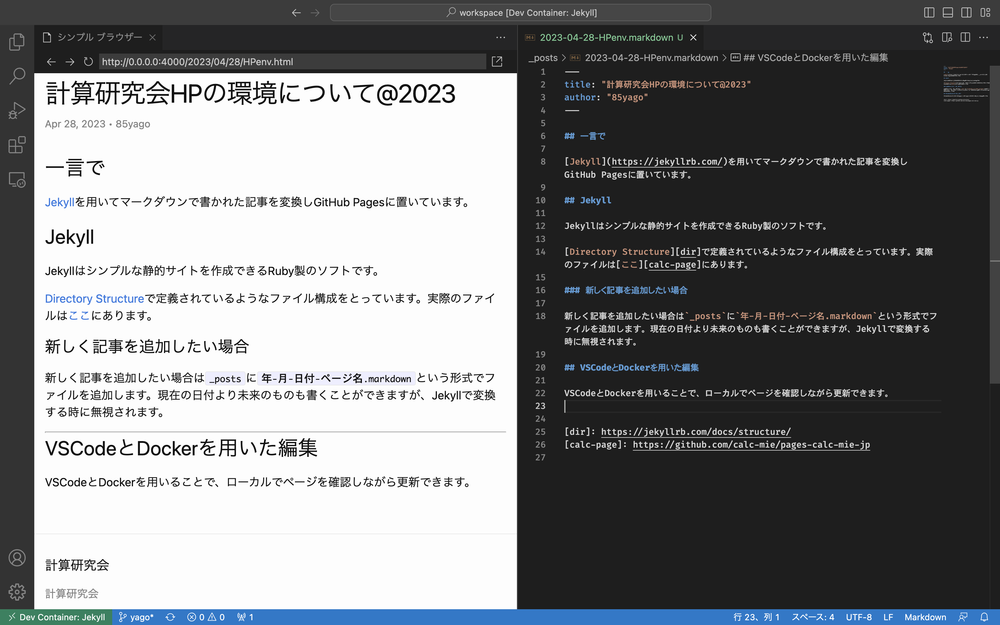

# calc-mie/pages-calc-mie-jp

計算研究会のホームページです。[https://www.calc.mie.jp/](https://www.calc.mie.jp/)で運用されています。

## 新しく記事を追加したい場合

新しく記事を追加したい場合はまず、ブランチを切ってください。

その後、`_posts`に`年-月-日付-ページ名.markdown`という形式でファイルを追加します。現在の日付より未来のものも書くことができますが、Jekyllで変換する時に無視されます。

完成したらコミットし、プルリクエストをGitHub上で投げてください。

## VSCodeとDockerを用いた編集

VSCodeとDockerを用いることで、ローカルでページを確認しながら更新できます。

1. VSCodeとDockerをインストールします。
1. VSCodeにdevcontainer拡張機能を導入します。
1. このリポジトリを開きます。
1. `F1`キーを押し、`Dev Containers: Rebuild Container`を選択します。
1. 環境が立ち上がります。
